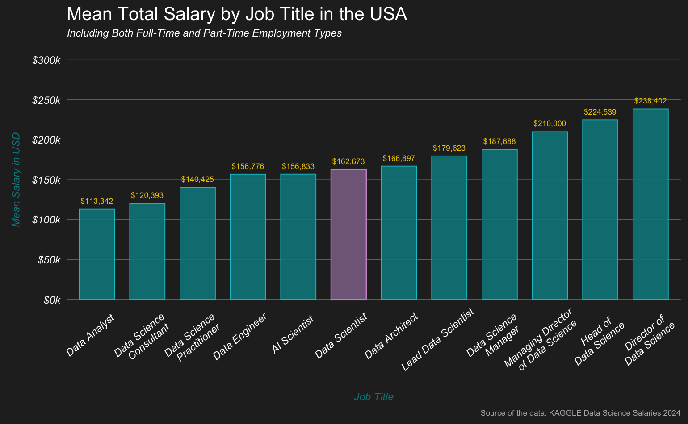
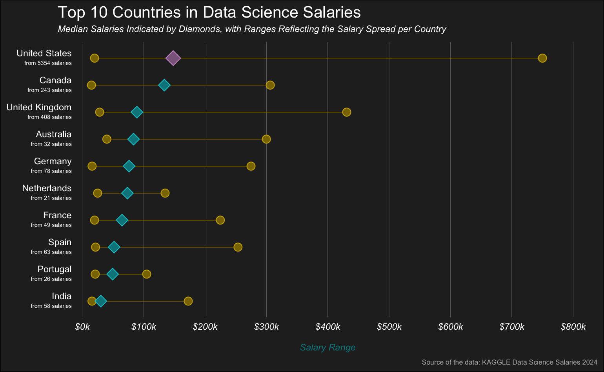
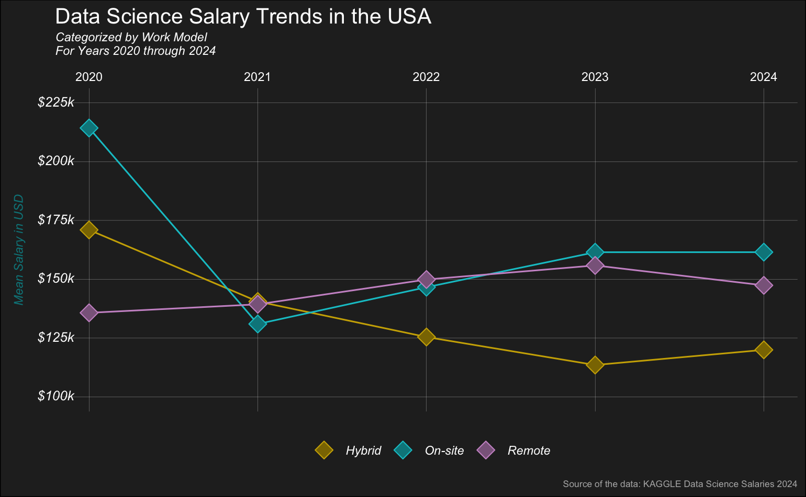

**Mean Total Salary by Job Title in the USA**

This bar chart illustrates the mean total salary, combining both full-time and part-time employment, for various data-related job titles in the USA. Each bar represents the average salary for a specific role, with 'Data Analyst' on the lower end at $113,342 and 'Director of Data Science' on the higher end at $238,402. Salaries generally increase with seniority, as seen with 'Data Scientist' earning an average of $162,673, and roles with leadership titles such as 'Managing Director of Data Science' and 'Head of Data Science' earning over $210,000. The chart emphasizes the salary progression associated with increased responsibility and specialized skills in the field of data science.

**Top 10 Countries in Data Science Salaries**

This dumbbell plot visualizes the salary range of data science professionals across the top 10 countries, with a clear indication of both median salaries (represented by diamonds) and the spread of salaries (denoted by horizontal lines) for each country. The United States stands out with the highest median salary and also exhibits the widest salary range, extending close to $800,000, indicative of a highly variable pay scale. The data points are supported by the number of reported salaries, providing a robustness indicator to the represented statistics; for instance, the United States' median is based on 3,534 salaries. Other countries like Canada, the United Kingdom, and India also show considerable spreads in salaries, though not reaching as high as the U.S. The plot emphasizes the significant geographical salary discrepancies within the field of data science, highlighting the lucrative prospects in certain regions and the diverse global market for data science expertise.

**Data Science Salary Trends in the USA**

This line graph delineates the evolution of data science salaries in the USA from 2020 to 2024, segmented by work model: hybrid, on-site, and remote. Initially, on-site positions commanded the highest salaries, but over time, they saw a decline, eventually aligning with remote positions, which remained relatively stable throughout the period. Hybrid roles, represented by the yellow line, witnessed a decline in 2020 and continued to earn lower salaries compared to the other work models. The persistence of lower salaries for hybrid roles could reflect market dynamics or preferences for fully on-site or remote arrangements. The data underscores a significant shift in the data science landscape, where remote work model is not only becoming more prevalent but also increasingly competitive in terms of compensation. This trend reflects the broader changes in work dynamics and the growing flexibility in the technology sector.